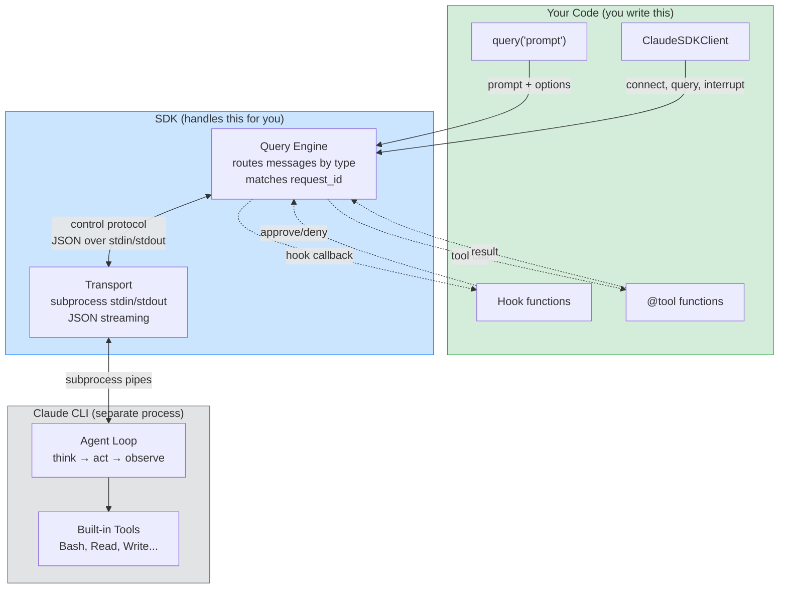

# Understanding Claude Agent SDK — The Feynman Way

**Prerequisite:** You know Python async/await (can write `async def`, use `async for`, and understand `async with`). You've never used claude-agent-sdk before.

**What you'll learn:** The 4 core concepts — `query()`, `ClaudeSDKClient`, hooks, and MCP tools — through simple analogies, then we'll go deeper where the analogies break down.

---

## Part 1: Simple Explanations

### query() = Sending a Letter

Think of `query()` as sending a letter. You write your message (the prompt), put it in an envelope with instructions (options like system prompt, budget limit, model choice), and drop it in the mailbox. The postal service picks it up, delivers it to Claude, Claude writes a reply, and the postal service delivers the reply back to you — page by page.

Here's the key: you get pages back one at a time as an `AsyncIterator[Message]`. Each page might be text Claude wrote, a tool Claude used, or a final summary with cost info. When the last page arrives, the conversation is done. You can't write back — you'd have to send a whole new letter.

```python
async for message in query(prompt="What is 2+2?"):
    print(message)  # Each "page" arrives as it's ready
```

**What this maps to in code:** `query()` in `query.py` creates an `InternalClient`, which spawns a CLI subprocess, sends your prompt via stdin, reads responses from stdout, and tears everything down when the stream ends. You never see any of this — just the messages.

### ClaudeSDKClient = A Phone Call

Now think of `ClaudeSDKClient` as making a phone call. You pick up the phone (`async with ClaudeSDKClient() as client`), the line connects (the CLI subprocess starts, the initialize handshake happens), and now you can have a real conversation.

You say something (`client.query("Hello")`), listen to the response (`async for msg in client.receive_response()`), then say something else based on what you heard. Claude remembers everything from earlier in the call — there's context. If Claude is rambling, you can interrupt (`client.interrupt()`). When you hang up (exit the `async with` block), the line is closed cleanly.

```python
async with ClaudeSDKClient() as client:
    await client.query("Analyze this code")
    async for msg in client.receive_response():
        process(msg)

    await client.query("Now fix the bug you found")  # Claude remembers
    async for msg in client.receive_response():
        process(msg)
```

**What this maps to in code:** `ClaudeSDKClient` in `client.py` keeps the subprocess alive between queries. The CLI process maintains conversation state. `receive_response()` yields messages until a `ResultMessage` arrives, then stops. You can call `query()` again for the next turn.

**When to use which:** Letter (`query()`) when you have a single question and don't need follow-ups. Phone call (`ClaudeSDKClient`) when you need a conversation, hooks, interrupts, or custom tools.

### The Transport = A Pipe Under the Floor

Between your Python code and the Claude CLI, there's a pipe you never see. This is `SubprocessCLITransport`. It handles starting the CLI process, sending JSON through stdin, reading JSON from stdout, and cleaning up when done.

You don't interact with the pipe directly — `query()` and `ClaudeSDKClient` handle the plumbing for you. But it's useful to know it exists because if something goes wrong (CLI not found, process crashes), the error messages come from this layer.

The pipe always uses streaming mode (`--input-format stream-json`), even for one-shot `query()` calls. Everything is JSON messages flowing in both directions.

**What this maps to in code:** `SubprocessCLITransport` in `_internal/transport/subprocess_cli.py` spawns the CLI with specific flags, manages stdin/stdout/stderr streams via anyio, and handles buffered JSON parsing.

### Hooks = Checkpoint Guards

Imagine the CLI is walking down a corridor, executing a task. At certain doors — before using a tool (PreToolUse), after using a tool (PostToolUse), when stopping (Stop) — there's a guard you've stationed.

Each guard is an async Python function you wrote. When the CLI reaches a door, it pauses, sends a message to your guard describing what it's about to do, and waits. Your guard inspects the situation and makes a decision: "go ahead" (approve), "stop right there" (block with a reason), or "go ahead but change this" (modify the input).

```python
async def no_dangerous_commands(input_data, tool_use_id, context):
    if "rm -rf" in input_data.get("command", ""):
        return {"hookSpecificOutput": {
            "hookEventName": "PreToolUse",
            "permissionDecision": "deny",
            "permissionDecisionReason": "Too dangerous"
        }}
    return {}  # Empty = approve
```

**What this maps to in code:** During initialization, `Query` registers your hook functions with unique callback IDs. When the CLI hits a hook point, it sends a `control_request` with the callback ID. `Query` looks up your function, calls it, converts the response (translating Python-safe names like `async_` to wire format `async`), and sends the decision back.

### MCP Tools = Your Own Toolbox

Claude comes with built-in tools — Bash, Read, Write, Edit, Glob, Grep. But what if you want Claude to check the weather, query your database, or call your API? That's what MCP tools are for.

You define a tool with the `@tool` decorator: give it a name, description, and parameter schema. Then bundle it into a server with `create_sdk_mcp_server()`. When Claude decides to use your tool, the call stays inside your Python process — no subprocess, no network call. Your function runs, returns a result, and Claude sees it instantly.

```python
@tool("get_weather", "Get weather for a city", {"city": str})
async def get_weather(args):
    city = args["city"]
    return {"content": [{"type": "text", "text": f"Sunny in {city}, 22C"}]}
```

**What this maps to in code:** `Query._handle_sdk_mcp_request()` intercepts tool calls meant for SDK MCP servers. It manually routes JSONRPC methods (`tools/call`, `tools/list`) to your server's handlers. The `@tool` decorator registers your function in the server's tool registry.

---

## Part 2: Where the Analogies Break Down

After writing these explanations, here's what's still unclear or hand-wavy:

**Gap 1: How does the "pipe" actually work?** I said "JSON messages in both directions" — but how does the SDK know which response goes with which request? If the CLI sends a hook callback while you're waiting for an initialize response, how does it sort them out?

**Gap 2: If query() is "sending a letter," why is it always streaming?** A letter metaphor implies send-and-receive. But the code shows query() also uses `--input-format stream-json`. Why doesn't it just pass the prompt as a command-line argument?

**Gap 3: How does the CLI "pause" for hooks?** I said the guard "waits" — but the CLI is a separate process. How does a subprocess pause mid-execution and wait for a Python function to return?

**Gap 4: Why anyio instead of asyncio?** Most Python async code uses `asyncio`. Why does the SDK need a different library?

---

## Part 3: Fixing the Gaps

### Gap 1 Resolved: The Control Protocol and request_id

The pipe isn't just raw JSON flowing randomly. There's a structured control protocol. Every request the SDK sends to the CLI includes a unique `request_id` (like `req_1_a3f2b1c4`). When the CLI responds, it includes the same `request_id`. The `Query` class maintains a dictionary of pending requests — each one has an `anyio.Event` that gets triggered when the matching response arrives.

This means multiple things can happen simultaneously: you're waiting for an initialize response, and a hook callback arrives. The `_read_messages()` loop in `Query` routes each incoming message by its `type` field:
- `control_response` → match the `request_id`, wake up whoever is waiting
- `control_request` → it's the CLI asking *us* something (hook callback, tool permission, MCP call)
- Everything else → regular message, push it to the message stream for `receive_messages()` to yield

### Gap 2 Resolved: Streaming Enables Agents and Large Configs

The SDK always uses streaming mode because the initialize request — sent via stdin after the subprocess starts — can contain large payloads: agent definitions, hook configurations, MCP server configs. These would overflow command-line argument limits. By using stdin, the SDK can send arbitrarily large configurations.

For `query()`, after sending the initialize request and the user message via stdin, the SDK calls `wait_for_result_and_end_input()`. If there are hooks or MCP servers that need bidirectional communication, it keeps stdin open until the first result arrives. Otherwise, it closes stdin immediately, signaling to the CLI that no more input is coming.

### Gap 3 Resolved: The CLI Sends a Request and Waits for a Response

The "pausing" is simpler than it sounds. The CLI and the SDK communicate over stdin/stdout using the control protocol. When the CLI hits a hook point, it writes a `control_request` JSON to stdout and blocks — it literally waits, reading from stdin for the matching `control_response`. Meanwhile, the SDK's `_read_messages()` loop picks up the request, spawns a task to handle it (so it doesn't block the message stream), calls your Python function, and writes the response back to the CLI's stdin. The CLI reads it, gets the decision, and continues.

From the CLI's perspective, it's synchronous: send request, wait for response, continue. From the SDK's perspective, it's all async: the hook handler runs concurrently with message reading.

### Gap 4 Resolved: anyio = Works with Both asyncio and trio

anyio is a thin compatibility layer that works on top of both asyncio and trio. The SDK uses anyio so that users of trio (a stricter, more structured async framework) can use it too. In practice, 95% of users will use asyncio and never notice.

The SDK uses anyio's task groups (`anyio.create_task_group()`) to manage concurrent operations like reading messages, streaming input, and handling control requests. Task groups ensure that when the SDK shuts down, all spawned tasks are properly cancelled and cleaned up — no orphaned coroutines.

---

## Part 4: The Mental Model

Here's how everything fits together:



**Reading the diagram:** Green is what you write. Blue is what the SDK handles automatically. Gray is the CLI subprocess. Solid arrows are the main data flow. Dashed arrows are the extension points (hooks and MCP tools) where you can inject your own logic.

**The key insight:** The SDK is a bridge. On one side, your Python code with clean async APIs. On the other side, a CLI subprocess doing the actual work. The bridge handles all the messy details: starting the process, speaking the JSON protocol, matching requests to responses, routing hook callbacks, and cleaning up when done.

---

## What to Do Next

You now have the mental model. To get hands-on:

1. **Try `query()`** — Copy the 3-line example from Part 1. Run it. Watch messages arrive.
2. **Try `ClaudeSDKClient`** — Use the phone call pattern. Send two messages in the same session.
3. **Add a hook** — Copy the "no dangerous commands" example. See what happens when Claude tries to run `rm -rf`.
4. **Read the cheatsheet** — `self-explores/context/claude-agent-sdk-cheatsheet.md` has 14 ready-to-use patterns.
5. **Watch the workshop** — Thariq Shihipar's [Full Workshop](https://www.youtube.com/watch?v=TqC1qOfiVcQ) (1h52m) covers everything with live coding.
