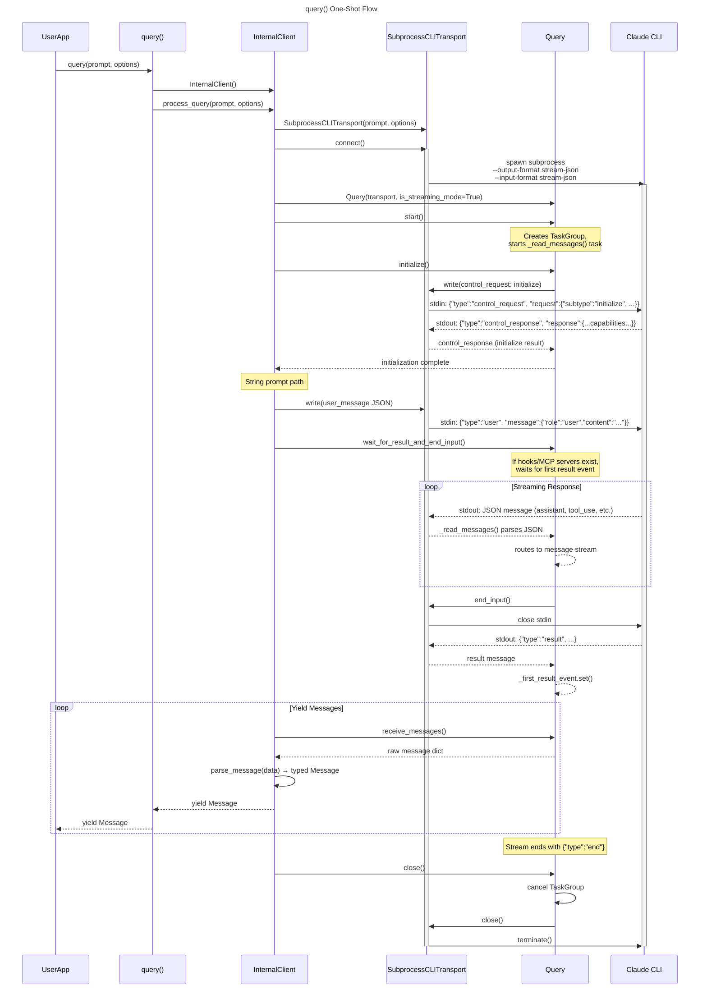
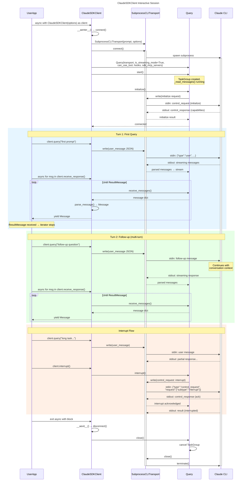
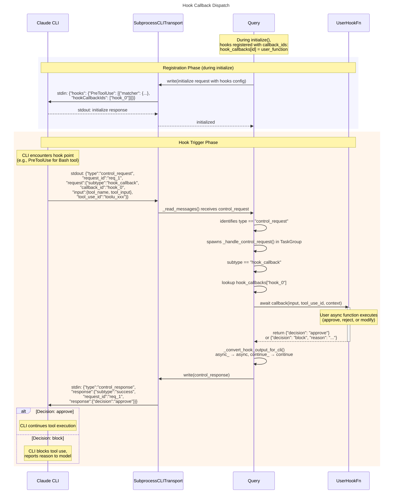
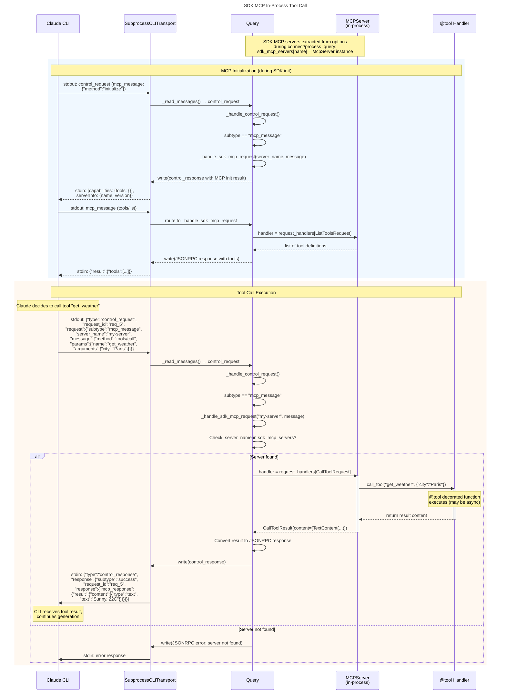

# Sequence Diagrams — Claude Agent SDK Python

| # | Diagram | Description | Participants |
|---|---------|-------------|--------------|
| 1 | query() One-Shot Flow | Complete lifecycle of a stateless one-shot query | UserApp, query(), InternalClient, Transport, Query, CLI |
| 2 | ClaudeSDKClient Interactive Session | Multi-turn bidirectional conversation with interrupt | UserApp, ClaudeSDKClient, Transport, Query, CLI |
| 3 | Hook Callback Dispatch | CLI-initiated hook callback routed to Python handler | CLI, Transport, Query, UserHookFn |
| 4 | SDK MCP In-Process Tool Call | In-process MCP tool execution via @tool decorator | CLI, Transport, Query, MCPServer, ToolHandler |

---

## 1. query() One-Shot Flow

Shows the complete lifecycle when a user calls `query(prompt="...", options=...)`. The SDK creates an `InternalClient`, which sets up transport and `Query`, performs the initialize handshake, sends the prompt, streams responses, and tears everything down.

**Key points from source code:**
- `query()` in `query.py:11` creates `InternalClient` and delegates to `process_query()`
- `InternalClient.process_query()` in `_internal/client.py:44` orchestrates the full lifecycle
- Transport always uses `--input-format stream-json` (line 331 in subprocess_cli.py)
- For string prompts, the user message is written to stdin after initialize (client.py:126-133)
- `wait_for_result_and_end_input()` keeps stdin open if hooks/MCP servers need bidirectional communication

---

## 2. ClaudeSDKClient Interactive Session

Shows a multi-turn conversation session using `ClaudeSDKClient` as an async context manager, including follow-up messages and interrupt capability.

**Key points from source code:**
- `ClaudeSDKClient.__aenter__()` calls `connect()` with no prompt → uses empty async generator (client.py:102-107)
- `client.query()` in `client.py:197` writes user messages directly to transport via JSON
- `receive_response()` in `client.py:442` wraps `receive_messages()` and stops after `ResultMessage`
- `interrupt()` sends a control request with `subtype: "interrupt"` (query.py:536-538)
- `__aexit__()` always calls `disconnect()` → `query.close()` → `transport.close()`

---

## 3. Hook Callback Dispatch

Shows how the CLI initiates a hook callback (e.g., PreToolUse) and how the SDK's `Query` class dispatches it to user-defined Python async functions. This is the most complex flow because the CLI is the initiator.

**Key points from source code:**
- Hook registration happens in `Query.initialize()` (query.py:119-163): each hook gets a unique `callback_id` mapped to the Python function
- CLI sends hook callbacks as `control_request` with `subtype: "hook_callback"` (query.py:288)
- `_handle_control_request()` at query.py:236 dispatches based on subtype
- Python field names `async_` and `continue_` are converted to `async`/`continue` for the wire format by `_convert_hook_output_for_cli()` (query.py:34-50)
- Response matching uses `request_id` to correlate requests and responses

---

## 4. SDK MCP In-Process Tool Call

Shows how SDK MCP servers (defined via `@tool` decorator and `create_sdk_mcp_server()`) handle tool calls entirely in-process. Unlike external MCP servers that run as subprocesses, SDK MCP tools execute within the Python process.

**Key points from source code:**
- SDK MCP servers are extracted from `options.mcp_servers` where `type == "sdk"` (client.py:143-147)
- `_handle_sdk_mcp_request()` at query.py:394 manually routes JSONRPC methods since Python MCP SDK lacks Transport abstraction
- Supported methods: `initialize`, `tools/list`, `tools/call`, `notifications/initialized` (query.py:431-514)
- Tool calls go through `server.request_handlers[CallToolRequest]` which invokes the `@tool`-decorated handler
- The `instance` field is stripped from SDK server config before passing to CLI (subprocess_cli.py:246-250)
- All communication is in-process — no subprocess IPC for SDK MCP tools
