# Claude Agent SDK — Use Case Diagram

> SDK version: 0.1.48 | Date: 2026-03-22

## Actors

| Actor | UML Type | Description |
|-------|----------|-------------|
| Developer | Primary | Python developer who writes code using the SDK |
| Claude Code CLI | System | Subprocess that executes prompts and manages tools |
| External MCP Server | External | Third-party MCP servers connected via subprocess |

**Why no Hook System actor?** In UML, an actor is an entity *outside* the system boundary. The Hook System is internal to the SDK — it is a mechanism triggered by the Developer (who defines hooks) and the CLI (which sends hook callbacks).

---

## Use Case Diagram

```mermaid
graph LR
    DEV(("Developer<br/>&#60;&#60;primary&#62;&#62;"))
    CLI(("Claude Code CLI<br/>&#60;&#60;system&#62;&#62;"))
    EMCP(("External MCP<br/>Server<br/>&#60;&#60;external&#62;&#62;"))

    subgraph SYSTEM["claude-agent-sdk"]

        subgraph CORE["Core Query"]
            UC1(["UC1: Execute<br/>Simple Query"])
            UC2(["UC2: Run Interactive<br/>Conversation"])
            UC3(["UC3: Stream Response<br/>Messages"])
        end

        subgraph TOOLS["Tool & Extension"]
            UC4(["UC4: Define Custom<br/>MCP Tools"])
            UC5(["UC5: Connect External<br/>MCP Servers"])
            UC6(["UC6: Orchestrate<br/>Agent with Tools"])
        end

        subgraph CONTROL["Control & Safety"]
            UC7(["UC7: Control Tool Use<br/>via Hooks"])
            UC8(["UC8: Manage Permission<br/>Mode"])
            UC9(["UC9: Set Budget &<br/>Token Limits"])
            UC10(["UC10: Approve/Deny<br/>Tool Permissions"])
        end

        subgraph CONFIG["Session & Config"]
            UC11(["UC11: Customize System<br/>Prompt & Model"])
            UC12(["UC12: Manage Session<br/>State & History"])
        end

    end

    %% Developer associations
    DEV --> UC1
    DEV --> UC2
    DEV --> UC4
    DEV --> UC7
    DEV --> UC8
    DEV --> UC9
    DEV --> UC10
    DEV --> UC11
    DEV --> UC12

    %% CLI associations
    UC1 --> CLI
    UC2 --> CLI
    UC3 --> CLI
    UC6 --> CLI
    UC7 --> CLI
    UC8 --> CLI
    UC10 --> CLI

    %% External MCP associations
    UC5 --> EMCP
    UC6 --> EMCP

    %% Include relationships
    UC2 -.->|"&#60;&#60;include&#62;&#62;"| UC3
    UC6 -.->|"&#60;&#60;include&#62;&#62;"| UC5

    %% Extend relationships
    UC7 -.->|"&#60;&#60;extend&#62;&#62;"| UC1
    UC9 -.->|"&#60;&#60;extend&#62;&#62;"| UC1
    UC10 -.->|"&#60;&#60;extend&#62;&#62;"| UC2

    %% Styles
    classDef actor fill:#fff2cc,stroke:#d6b656,color:#000
    classDef core fill:#d5e8d4,stroke:#82b366,color:#000
    classDef tools fill:#dae8fc,stroke:#6c8ebf,color:#000
    classDef control fill:#f8cecc,stroke:#b85450,color:#000
    classDef config fill:#e1d5e7,stroke:#9673a6,color:#000

    class DEV,CLI,EMCP actor
    class UC1,UC2,UC3 core
    class UC4,UC5,UC6 tools
    class UC7,UC8,UC9,UC10 control
    class UC11,UC12 config
```

---

## Use Case Descriptions

### Core Query Subsystem

| UC | Name | Description | Entry Point | Actors |
|----|------|-------------|-------------|--------|
| UC1 | Execute Simple Query | Send a one-shot prompt and receive all response messages | `query()` | Developer, CLI |
| UC2 | Run Interactive Conversation | Multi-turn bidirectional session with follow-ups and interrupts | `ClaudeSDKClient` | Developer, CLI |
| UC3 | Stream Response Messages | Receive partial messages in real-time during generation | `ClaudeSDKClient` | Developer, CLI |

### Tool & Extension Subsystem

| UC | Name | Description | Entry Point | Actors |
|----|------|-------------|-------------|--------|
| UC4 | Define Custom MCP Tools | Create in-process tools via `@tool` decorator and `create_sdk_mcp_server()` | Either | Developer |
| UC5 | Connect External MCP Servers | Connect third-party MCP servers via subprocess (stdio/sse/http) | Either | Developer, External MCP |
| UC6 | Orchestrate Agent with Tools | Define sub-agents with specialized tools, models, and prompts | Either | Developer, CLI, External MCP |

### Control & Safety Subsystem

| UC | Name | Description | Entry Point | Actors |
|----|------|-------------|-------------|--------|
| UC7 | Control Tool Use via Hooks | Register PreToolUse/PostToolUse callbacks to approve, deny, or modify tool calls | `ClaudeSDKClient` | Developer, CLI |
| UC8 | Manage Permission Mode | Set permission mode (default/acceptEdits/plan/bypassPermissions) at runtime | `ClaudeSDKClient` | Developer, CLI |
| UC9 | Set Budget & Token Limits | Cap spending with `max_budget_usd` and control thinking with `max_thinking_tokens` | Either | Developer, CLI |
| UC10 | Approve/Deny Tool Permissions | Dynamic per-tool permission decisions via `can_use_tool` callback | `ClaudeSDKClient` | Developer, CLI |

### Session & Configuration Subsystem

| UC | Name | Description | Entry Point | Actors |
|----|------|-------------|-------------|--------|
| UC11 | Customize System Prompt & Model | Set system prompt (string/preset/append) and choose model at init or runtime | Either | Developer, CLI |
| UC12 | Manage Session State & History | Continue/fork sessions, read historical session data, rewind files | `ClaudeSDKClient` | Developer, CLI |

---

## Relationships

### Include (mandatory composition)
- **UC2 includes UC3:** Interactive conversations always stream response messages
- **UC6 includes UC5:** Agent orchestration with external tools requires connecting MCP servers

### Extend (optional enhancement)
- **UC7 extends UC1:** Hooks can optionally gate tool execution during simple queries
- **UC9 extends UC1:** Budget limits can optionally cap query costs
- **UC10 extends UC2:** Permission callbacks can optionally control tool use in interactive sessions

---

## Legend

| Symbol | Meaning |
|--------|---------|
| `(( ))` Circle | Actor (external entity) |
| `([ ])` Stadium | Use Case |
| `───▶` Solid arrow | Association (actor participates in use case) |
| `╌╌▶ <<include>>` | Mandatory inclusion (base always includes target) |
| `╌╌▶ <<extend>>` | Optional extension (target optionally enhances base) |
| Green nodes | Core Query subsystem |
| Blue nodes | Tool & Extension subsystem |
| Red nodes | Control & Safety subsystem |
| Purple nodes | Session & Config subsystem |

> **Note:** Mermaid does not have a native `usecaseDiagram` type. This diagram uses `graph LR` with styled nodes to approximate UML use case diagram semantics.
