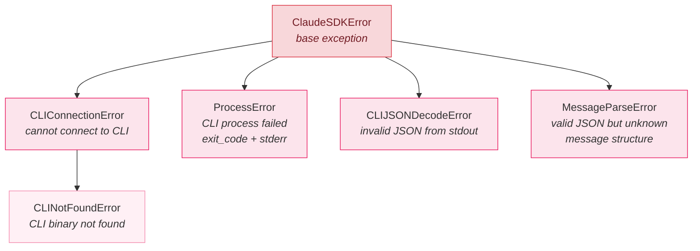

# Claude Agent SDK — Architecture Diagrams

> SDK version: 0.1.48 | Date: 2026-03-22 | 15 source files

## Legend

| Color | Layer | Description |
|-------|-------|-------------|
| Green | Public API | User-facing entry points and decorators |
| Blue | Internal Processing | Control protocol, message parsing, session management |
| Orange | Transport | Subprocess I/O, CLI binary discovery, JSON streaming |
| Gray | External | Claude CLI process, external MCP servers |
| Pink | Cross-cutting | Types, errors, version info |

**Arrow types:**
- `──▶` Solid: data flow (requests/responses)
- `╌╌▶` Dashed: configuration or type dependency
- Labels describe what flows along the arrow

---

## 1. Main Architecture Diagram

The SDK has two entry points (`query()` for one-shot, `ClaudeSDKClient` for interactive) that converge at the `Query` control protocol handler. Query manages all bidirectional communication with the Claude CLI subprocess through `SubprocessCLITransport`.

```mermaid
graph TD
    subgraph PUB["Public API Layer"]
        QF["query&#40;&#41;<br/><i>query.py</i>"]
        CSC["ClaudeSDKClient<br/><i>client.py</i>"]
        TOOL["@tool decorator<br/><i>__init__.py</i>"]
        CMCP["create_sdk_mcp_server&#40;&#41;<br/><i>__init__.py</i>"]
    end

    subgraph INT["Internal Processing Layer"]
        IC["InternalClient<br/><i>_internal/client.py</i>"]
        Q["Query<br/><i>_internal/query.py</i>"]
        MP["MessageParser<br/><i>message_parser.py</i>"]
    end

    subgraph TRA["Transport Layer"]
        SCT["SubprocessCLITransport<br/><i>subprocess_cli.py</i>"]
    end

    subgraph EXT["External"]
        CLI["Claude Code CLI<br/><i>subprocess</i>"]
        EMCP["External MCP Servers<br/><i>separate processes</i>"]
    end

    subgraph CRS["Cross-cutting"]
        TYPES["types.py<br/><i>Message, Options, Hooks</i>"]
        ERRS["_errors.py<br/><i>ClaudeSDKError hierarchy</i>"]
        SESS["sessions.py<br/><i>historical session reader</i>"]
    end

    %% query() path
    QF -->|"prompt + options"| IC
    IC -->|"process_query&#40;&#41;"| Q

    %% ClaudeSDKClient path
    CSC -->|"connect / query / interrupt"| Q

    %% MCP tool registration
    TOOL -->|"defines tools"| CMCP
    CMCP -->|"McpServer instance"| Q

    %% Internal processing
    Q -->|"control requests<br/>via stdin JSON"| SCT
    SCT -->|"stdout JSON messages"| Q
    Q -->|"raw message dicts"| MP
    MP -->|"typed Message objects"| QF
    MP -->|"typed Message objects"| CSC

    %% Transport to CLI
    SCT -->|"stdin: stream-json"| CLI
    CLI -->|"stdout: JSON messages"| SCT
    CLI -.->|"MCP protocol"| EMCP

    %% Cross-cutting dependencies
    TYPES -.->|"used by all layers"| PUB
    TYPES -.->|"used by all layers"| INT
    ERRS -.->|"raised by"| TRA

    %% Styles
    classDef public fill:#d4edda,stroke:#28a745,color:#155724
    classDef internal fill:#cce5ff,stroke:#007bff,color:#004085
    classDef transport fill:#fff3cd,stroke:#ffc107,color:#856404
    classDef external fill:#e2e3e5,stroke:#6c757d,color:#383d41
    classDef crosscut fill:#f8d7da,stroke:#dc3545,color:#721c24

    class QF,CSC,TOOL,CMCP public
    class IC,Q,MP internal
    class SCT transport
    class CLI,EMCP external
    class TYPES,ERRS,SESS crosscut
```

**How to read:** Top = user application code, bottom = CLI subprocess. Data flows down (requests) and up (responses). The two entry points (left: `query()`, right: `ClaudeSDKClient`) converge at `Query`, which is the central hub managing all communication with the CLI.

---

## 2. Detail: Control Protocol Message Routing

Inside `Query._read_messages()`, incoming JSON from the CLI is routed to three different handlers based on the `type` field.

```mermaid
graph TD
    subgraph INPUT["CLI stdout"]
        MSG["JSON message from CLI"]
    end

    subgraph ROUTER["Query._read_messages&#40;&#41;"]
        CHECK{"message.type?"}
    end

    subgraph HANDLERS["Handlers"]
        CR["control_response<br/>Match request_id → wake Event"]
        CQ["control_request<br/>Spawn _handle_control_request&#40;&#41;"]
        MS["Regular message<br/>Send to message stream"]
    end

    subgraph SUBTYPES["control_request subtypes"]
        HOOK["hook_callback<br/>Dispatch to user hook fn"]
        PERM["can_use_tool<br/>Dispatch to permission callback"]
        MCP["mcp_message<br/>Route to SDK MCP server"]
    end

    subgraph OUTPUT["Consumers"]
        PENDING["pending_control_responses<br/>dict&#91;request_id, Event&#93;"]
        STREAM["_message_receive<br/>anyio memory stream"]
    end

    MSG --> CHECK
    CHECK -->|"control_response"| CR
    CHECK -->|"control_request"| CQ
    CHECK -->|"other"| MS

    CR --> PENDING
    MS --> STREAM

    CQ --> HOOK
    CQ --> PERM
    CQ --> MCP

    classDef router fill:#e8f4fd,stroke:#2196F3
    classDef handler fill:#fff3e0,stroke:#ff9800
    classDef output fill:#e8f5e9,stroke:#4caf50

    class CHECK router
    class CR,CQ,MS,HOOK,PERM,MCP handler
    class PENDING,STREAM output
```

---

## 3. Detail: Hook System Architecture

Shows how hooks are registered during `initialize()` and dispatched when the CLI triggers them.

```mermaid
graph TD
    subgraph REG["Registration &#40;during initialize&#41;"]
        HM["HookMatcher<br/>matcher pattern + hooks list"]
        CB["User async callbacks"]
        MAP["hook_callbacks dict<br/>callback_id → function"]
        INIT["Initialize request<br/>hooks config with callback_ids"]
    end

    subgraph TRIGGER["Trigger &#40;runtime&#41;"]
        CLIP["CLI encounters hook point"]
        REQ["control_request<br/>subtype: hook_callback<br/>callback_id + input + tool_use_id"]
    end

    subgraph DISPATCH["Dispatch &#40;Query&#41;"]
        LOOKUP["Lookup hook_callbacks&#91;callback_id&#93;"]
        CALL["await callback&#40;input, tool_use_id, ctx&#41;"]
        CONVERT["_convert_hook_output_for_cli&#40;&#41;<br/>async_ → async<br/>continue_ → continue"]
    end

    subgraph RESPONSE["Response"]
        RESP["control_response<br/>request_id match"]
        DECIDE{"CLI decision"}
        APPROVE["Continue execution"]
        BLOCK["Block tool use"]
    end

    HM -->|"extract hooks"| CB
    CB -->|"register with id"| MAP
    MAP -->|"callback_ids"| INIT
    INIT -->|"stdin to CLI"| CLIP

    CLIP -->|"stdout"| REQ
    REQ --> LOOKUP
    LOOKUP --> CALL
    CALL --> CONVERT
    CONVERT --> RESP
    RESP --> DECIDE
    DECIDE -->|"approve"| APPROVE
    DECIDE -->|"deny"| BLOCK

    classDef reg fill:#e3f2fd,stroke:#1565c0
    classDef trigger fill:#fce4ec,stroke:#c62828
    classDef dispatch fill:#f3e5f5,stroke:#7b1fa2
    classDef resp fill:#e8f5e9,stroke:#2e7d32

    class HM,CB,MAP,INIT reg
    class CLIP,REQ trigger
    class LOOKUP,CALL,CONVERT dispatch
    class RESP,DECIDE,APPROVE,BLOCK resp
```

**Hook events:** PreToolUse, PostToolUse, PostToolUseFailure, UserPromptSubmit, Stop, SubagentStart, SubagentStop, PreCompact, Notification, PermissionRequest

---

## 4. Detail: SDK MCP vs External MCP

Shows the key architectural distinction: SDK MCP tools execute in-process, while external MCP servers run as separate subprocesses managed by the CLI.

```mermaid
graph LR
    subgraph SDK_PATH["SDK MCP &#40;in-process&#41;"]
        TOOL2["@tool decorator"]
        FACTORY["create_sdk_mcp_server&#40;&#41;"]
        SERVER["McpServer instance<br/>in Python process"]
        HANDLER["@tool handler function"]
    end

    subgraph EXT_PATH["External MCP &#40;subprocess&#41;"]
        CONFIG["MCP config<br/>stdio/sse/http"]
        PROC["Separate process<br/>managed by CLI"]
        EXTOOL["External tool handlers"]
    end

    subgraph QUERY["Query &#40;routing&#41;"]
        Q2["_handle_sdk_mcp_request&#40;&#41;"]
    end

    subgraph CLI2["Claude CLI"]
        DECIDE2{"Tool is SDK<br/>or External?"}
    end

    TOOL2 --> FACTORY
    FACTORY --> SERVER

    DECIDE2 -->|"SDK: control_request<br/>subtype: mcp_message"| Q2
    Q2 -->|"CallToolRequest"| SERVER
    SERVER --> HANDLER
    HANDLER -->|"result"| Q2
    Q2 -->|"control_response"| DECIDE2

    DECIDE2 -->|"External: direct<br/>MCP protocol"| PROC
    CONFIG --> PROC
    PROC --> EXTOOL
    EXTOOL -->|"result"| PROC
    PROC -->|"result"| DECIDE2

    classDef sdk fill:#e8f5e9,stroke:#2e7d32
    classDef ext fill:#e2e3e5,stroke:#757575
    classDef query fill:#e3f2fd,stroke:#1565c0
    classDef cli fill:#fff3e0,stroke:#ef6c00

    class TOOL2,FACTORY,SERVER,HANDLER sdk
    class CONFIG,PROC,EXTOOL ext
    class Q2 query
    class DECIDE2 cli
```

**Key insight:** SDK MCP tools never leave the Python process. The CLI sends tool call requests to the SDK via `control_request`, and the SDK executes the `@tool`-decorated function directly and returns the result via `control_response`.

---

## 5. Detail: Error Hierarchy

---

## 6. Component Inventory

| Component | File | Lines | Layer | Role |
|-----------|------|-------|-------|------|
| `query()` | `query.py` | 124 | Public API | One-shot async generator entry point |
| `ClaudeSDKClient` | `client.py` | ~400 | Public API | Stateful bidirectional session manager |
| `@tool` + `create_sdk_mcp_server()` | `__init__.py` | 445 | Public API | MCP tool definition and server factory |
| `InternalClient` | `_internal/client.py` | 146 | Internal | Orchestrates query() lifecycle |
| `Query` | `_internal/query.py` | ~500 | Internal | Control protocol handler (most complex) |
| `MessageParser` | `_internal/message_parser.py` | ~200 | Internal | JSON dict → typed Message objects |
| `sessions` | `_internal/sessions.py` | ~150 | Internal | Historical session reader |
| `SubprocessCLITransport` | `_internal/transport/subprocess_cli.py` | ~400 | Transport | CLI subprocess lifecycle + JSON streaming |
| `Transport` (abstract) | `_internal/transport/__init__.py` | ~50 | Transport | Abstract base (connect, write, read, close) |
| `types.py` | `types.py` | ~800 | Cross-cutting | All public types (largest file) |
| `_errors.py` | `_errors.py` | 57 | Cross-cutting | Error hierarchy |
