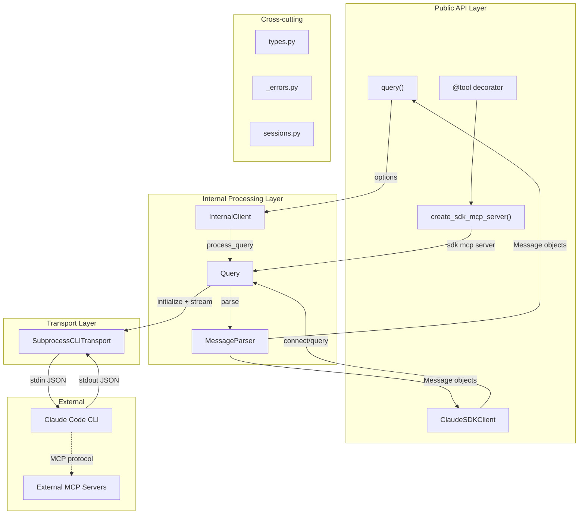

# Ve Architecture Diagram — Detailed Design

## 1. Objective
Create Mermaid `graph TD` architecture diagrams showing 4+ layers of the Claude Agent SDK, with data flow arrows and labeled components, renderable on GitHub Markdown.

## 2. Scope
**In-scope:**
- Main architecture diagram with 5 layers: Public API, Internal, Transport, External, Cross-cutting
- Data flow arrows showing how prompts flow from user code to CLI and responses flow back
- Component labels with module names matching actual source files
- Detail sub-diagrams for complex subsystems if the main diagram becomes too crowded
- Verification that Mermaid syntax renders correctly on GitHub

**Out-of-scope:**
- Sequence diagrams (only architecture/component diagrams)
- UML class diagrams (too detailed for an overview)
- Interactive or animated diagrams
- Draw.io or other non-Mermaid formats
- Diagrams of test infrastructure or CI/CD pipeline
- Diagrams of the CLI binary internals (only SDK-to-CLI boundary)

## 3. Input / Output
**Input:**
- `self-explores/context/code-architecture.md` (from task claudeagentsdk-d0g) -- annotated directory tree, 4 traced flows, error hierarchy, type system overview
- CLAUDE.md architecture section -- for the high-level layer descriptions

**Output:**
- `self-explores/tasks/claudeagentsdk-fl0-diagrams.md` -- Markdown file containing:
  1. Main architecture diagram (Mermaid `graph TD`)
  2. Optional: Hook system detail diagram
  3. Optional: MCP tool flow detail diagram
  4. Legend explaining color coding and arrow types
  5. Brief prose descriptions accompanying each diagram

## 4. Dependencies
- **Task dependencies:**
  - `claudeagentsdk-d0g` (P1: code architecture) -- REQUIRED. The architecture doc provides the structural knowledge needed to create accurate diagrams. This task cannot start until d0g is complete.
- **Tool dependencies:**
  - Read tool -- for reading the code-architecture.md input
  - Write tool -- for creating the output file
  - No MCP tools needed (this is a synthesis task, not a research task)

## 5. Flow

### Step 1: Design layout -- 5 layers and component inventory (~10 min)
Read `self-explores/context/code-architecture.md` from task d0g. Extract all components and organize into 5 layers:

**Layer 1 -- Public API (top, user-facing):**
- `query()` function (query.py)
- `ClaudeSDKClient` class (client.py)
- `@tool` decorator (__init__.py)
- `create_sdk_mcp_server()` (__init__.py)

**Layer 2 -- Internal Processing:**
- `InternalClient` (_internal/client.py) -- used by query() only
- `Query` (_internal/query.py) -- control protocol handler, message streaming, hook dispatch
- `MessageParser` (_internal/message_parser.py) -- JSON -> typed Message objects

**Layer 3 -- Transport:**
- `SubprocessCLITransport` (_internal/transport/subprocess_cli.py) -- subprocess lifecycle, stdin/stdout/stderr pipes, CLI binary discovery

**Layer 4 -- External (bottom, outside SDK):**
- Claude Code CLI process (subprocess)
- External MCP Servers (separate processes)

**Layer 5 -- Cross-cutting (side panel):**
- Types (types.py) -- Message, ClaudeAgentOptions, content blocks
- Errors (_errors.py) -- ClaudeSDKError hierarchy
- Sessions (sessions.py) -- historical session reader

Plan the visual layout:
- Top-to-bottom flow for the main request/response path
- Left side: query() path
- Right side: ClaudeSDKClient path
- Both converge at Query/Transport layers
- Cross-cutting types on the right margin
- Arrows: solid for data flow, dashed for configuration/type usage

**Verify:** All components from code-architecture.md are placed in exactly one layer. No component is missing.

### Step 2: Write main architecture diagram (~15 min)
Write the Mermaid `graph TD` code. Design principles:
- Use subgraphs for each layer with descriptive labels
- Color-code nodes: green for public API, blue for internal, orange for transport, gray for external
- Label arrows with data types (e.g., "ClaudeAgentOptions", "JSON messages", "Message objects")
- Keep node names short but recognizable (e.g., `QF[query&lpar;&rpar;]`, `CSC[ClaudeSDKClient]`)

Draft structure:


Refine: adjust layout, add style classes for colors, ensure no overlapping labels.

Use Mermaid style definitions:
```
classDef public fill:#d4edda,stroke:#28a745
classDef internal fill:#cce5ff,stroke:#007bff
classDef transport fill:#fff3cd,stroke:#ffc107
classDef external fill:#e2e3e5,stroke:#6c757d
classDef crosscut fill:#f8d7da,stroke:#dc3545
```

**Verify:** Mermaid code is syntactically valid (no unclosed brackets, proper arrow syntax). All 5 layers are represented. Data flow is bidirectional (request down, response up).

### Step 3: Write detail diagrams if needed (~10 min)
If the main diagram has more than ~25 nodes and becomes hard to read, split into focused sub-diagrams:

**Sub-diagram A: Hook System Flow**
```
Hook Definition (types.py) --> HookMatcher (query.py) --> CLI sends hook callback
--> Query dispatches to Python async function --> Hook result --> CLI receives response
```
Show: PreToolUse, PostToolUse, Stop event types and their callback signatures.

**Sub-diagram B: MCP In-Process Tool Flow**
```
@tool defines function --> create_sdk_mcp_server() builds Server
--> Query intercepts tool_use for SDK tools --> call_tool() in-process
--> Result sent back to CLI via control protocol
```
Show: Distinction between SDK MCP (in-process) and external MCP (subprocess).

**Sub-diagram C: Error Hierarchy**
Simple tree diagram:
```
ClaudeSDKError
  |- CLIConnectionError
  |    |- CLINotFoundError
  |- ProcessError
  |- CLIJSONDecodeError
  |- MessageParseError
```

Only create sub-diagrams that add clarity beyond the main diagram. If the main diagram is sufficient, skip this step.

**Verify:** Each sub-diagram has a clear title and 1-2 sentence explanation. Mermaid syntax is valid.

### Step 4: Verify renders on GitHub Markdown (~5 min)
Review the complete Mermaid code for common syntax issues:
- Parentheses in node labels must be escaped: `&lpar;` and `&rpar;` or use square brackets
- Quotes around labels with special characters
- Subgraph titles in quotes
- Arrow labels in `|"label"|` format
- No conflicting node IDs
- Style class definitions after the graph definition

Add surrounding prose to the markdown file:
- Brief introduction explaining what the diagram shows
- Legend for colors and arrow types
- Notes on how to read the diagram (top = user code, bottom = CLI process)

Write the final file with proper markdown structure:
```markdown
# Claude Agent SDK -- Architecture Diagrams

## Main Architecture

[prose description]

```mermaid
[main diagram]
```

## Detail: Hook System (optional)

[prose description]

```mermaid
[hook diagram]
```

...
```

**Verify:** Open the file and visually inspect Mermaid blocks for syntax errors. Confirm all layers are labeled. Confirm arrows have direction labels.

## 6. Edge Cases & Error Handling
| Case | Trigger | Expected | Recovery |
|------|---------|----------|----------|
| Main diagram too complex | More than 25-30 nodes from architecture doc | Diagram becomes unreadable when rendered | Split into main overview (key components only) + detail sub-diagrams for each subsystem |
| Mermaid syntax errors | Special characters in labels, unclosed brackets | Diagram fails to render on GitHub | Escape special characters; use simple labels without parentheses; test with Mermaid Live Editor mentally |
| Labels overlap when rendered | Long component names crowd the diagram | Poor visual clarity | Shorten names (e.g., "SubprocessCLITransport" -> "CLITransport"); use abbreviations with legend |
| code-architecture.md not available | Task d0g not complete yet | Missing input data | Cannot proceed -- this task has a hard dependency on d0g. Wait or use CLAUDE.md architecture section as minimal fallback |
| Architecture has more layers than expected | Code reveals additional abstraction layers | 5-layer model insufficient | Add layers to the model; diagram should reflect reality, not a preconceived structure |
| Mermaid version incompatibility | GitHub uses older Mermaid version | Advanced syntax features not supported | Stick to basic `graph TD` syntax; avoid flowchart-v2 or experimental features |

## 7. Acceptance Criteria
- **Happy 1:** Given code-architecture.md is available from task d0g, When main diagram is created, Then it renders on GitHub Markdown with 4+ layers, data flow arrows between layers, and all major components labeled with their source file names
- **Happy 2:** Given the diagram is viewed by a developer unfamiliar with the codebase, When they read it, Then they can identify: the two entry points (query/ClaudeSDKClient), the internal processing layer, the transport-to-CLI boundary, and the cross-cutting concerns -- without reading source code
- **Negative:** Given the main diagram exceeds 25 nodes, When readability is impacted, Then the diagram is split into a high-level overview plus 1-2 detail sub-diagrams, each independently renderable

## 8. Technical Notes
- **Mermaid dialect:** Use `graph TD` (top-down). Do NOT use C4 diagrams (limited GitHub support) or `flowchart` keyword (use `graph` for maximum compatibility)
- **Color coding via classDef:**
  - Green (`#d4edda`) -- Public API layer
  - Blue (`#cce5ff`) -- Internal processing layer
  - Yellow/Orange (`#fff3cd`) -- Transport layer
  - Gray (`#e2e3e5`) -- External processes
  - Red/Pink (`#f8d7da`) -- Cross-cutting concerns
- **Node ID conventions:** Use short uppercase abbreviations (QF, CSC, IC, Q, MP, SCT, CLI)
- **Arrow types:** `-->` for data flow, `-.->` for optional/config relationships, `==>` for bidirectional heavy traffic
- **GitHub Mermaid rendering:** Wrap in triple-backtick blocks with `mermaid` language identifier
- **Special characters:** Escape `()` in labels with `&lpar;` `&rpar;` or avoid them (use `["query function"]` instead of `["query()"]`)

## 9. Risks
- **Risk:** Mermaid rendering varies between GitHub, VS Code preview, and other Markdown renderers. **Mitigation:** Use only the most basic `graph TD` syntax; avoid advanced features. Test mentally against Mermaid spec.
- **Risk:** Architecture may be more nuanced than a single diagram can capture. **Mitigation:** The main diagram shows the "happy path" structure; sub-diagrams handle the complexity of hooks and MCP systems.
- **Risk:** Diagram may become outdated as SDK evolves. **Mitigation:** Include the SDK version (v0.1.48) and date in the diagram file header; note that diagrams reflect code as of task completion date.

## Worklog

### [10:20] Bat dau
- Doc code-architecture.md + source code da co trong context tu task truoc

### [10:35] Hoan thanh — 6 diagrams
**Ket qua:**
- Tao file `claudeagentsdk-fl0-diagrams.md` voi 6 Mermaid diagrams

**Diagrams da ve:**
1. **Main Architecture** — graph TD, 5 layers (Public/Internal/Transport/External/Cross-cutting), color-coded, 13 nodes, data flow arrows co labels
2. **Control Protocol Message Routing** — Query._read_messages() routing logic: control_response/control_request/regular → 3 handlers
3. **Hook System Architecture** — Registration (initialize) → Trigger (CLI) → Dispatch (Query) → Response flow
4. **SDK MCP vs External MCP** — Side-by-side comparison: in-process vs subprocess
5. **Error Hierarchy** — Tree: ClaudeSDKError → 5 subclasses
6. **Component Inventory** — Table tong hop 11 components voi file, lines, layer, role

**Files tao:**
- self-explores/tasks/claudeagentsdk-fl0-diagrams.md
